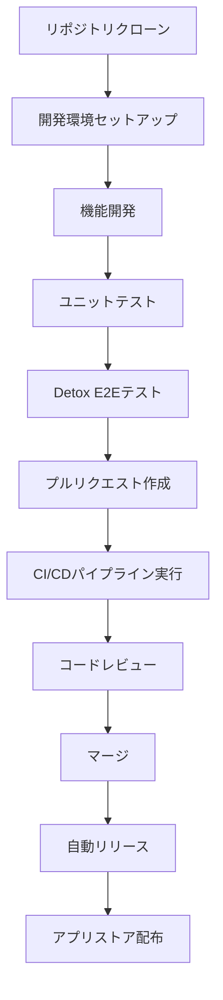

# 🚀 FridgeManager 開発フロー

## 📋 概要

FridgeManagerの開発フローは、Detoxによる自動テストとリリース・バージョンアップの自動化を重視した設計となっています。

## 🏗️ 開発フロー全体図



## 🔧 1. 初期セットアップ

### 1.1 リポジトリクローン

```bash
# リポジトリをクローン
git clone https://github.com/ClayFalcon/FridgeManager.git
cd FridgeManager

# ブランチ作成
git checkout -b feature/your-feature-name
```

### 1.2 開発環境セットアップ

```bash
# 依存関係のインストール
npm install

# 環境変数の設定
cp .env.example .env.development
# .env.developmentファイルにFirebase設定値を入力

# Firebase設定確認
npm run check:env

# 開発サーバー起動
npm run start:dev
```

### 1.3 Firebase設定

```bash
# Firebase CLIインストール（未インストールの場合）
npm install -g firebase-tools

# Firebaseログイン
firebase login

# 開発プロジェクトに切り替え
npm run firebase:use:dev

# Firestoreルールデプロイ
npm run firebase:deploy:rules:dev
```

## 🧪 2. テスト戦略

### 2.1 テストピラミッド

```
        E2E Tests (Detox)
       /                \
   Integration Tests    UI Tests
  /                    \
Unit Tests (Jest)    Component Tests
```

### 2.2 テスト実行フロー

```bash
# 1. ユニットテスト
npm run test:unit

# 2. カバレッジ確認
npm run test:coverage

# 3. Detox E2Eテスト（Android）
npm run test:detox:build
npm run test:detox:test

# 4. Detox E2Eテスト（iOS）
npm run test:detox:ios:build
npm run test:detox:ios:test

# 5. 全テスト実行
npm run test:all
```

### 2.3 Detox設定

Detoxは以下の設定で自動テストを実行：

- **Android**: API 26以上（Android 8.0以上）
- **iOS**: iOS 13.0以上
- **テストシナリオ**: ユーザー登録、冷蔵庫管理、通知機能など

## 🔄 3. CI/CDパイプライン

### 3.1 GitHub Actions設定

```yaml
# .github/workflows/ci.yml
name: CI/CD Pipeline

on:
  push:
    branches: [ main, develop ]
  pull_request:
    branches: [ main ]

jobs:
  test:
    runs-on: ubuntu-latest
    steps:
      - uses: actions/checkout@v3
      - uses: actions/setup-node@v3
        with:
          node-version: '18'
      - run: npm ci
      - run: npm run test:unit
      - run: npm run test:coverage
      
  detox-android:
    runs-on: ubuntu-latest
    steps:
      - uses: actions/checkout@v3
      - uses: actions/setup-node@v3
        with:
          node-version: '18'
      - run: npm ci
      - run: npm run test:detox:build
      - run: npm run test:detox:test
      
  detox-ios:
    runs-on: macos-latest
    steps:
      - uses: actions/checkout@v3
      - uses: actions/setup-node@v3
        with:
          node-version: '18'
      - run: npm ci
      - run: npm run test:detox:ios:build
      - run: npm run test:detox:ios:test
```

### 3.2 自動リリース設定

```yaml
# .github/workflows/release.yml
name: Release

on:
  push:
    tags:
      - 'v*'

jobs:
  release:
    runs-on: ubuntu-latest
    steps:
      - uses: actions/checkout@v3
      - uses: actions/setup-node@v3
        with:
          node-version: '18'
      - run: npm ci
      - run: npm run build:android:prod
      - run: npm run build:ios:prod
      - uses: actions/upload-artifact@v3
        with:
          name: app-builds
          path: |
            android/app/build/outputs/apk/
            ios/build/
```

## 📱 4. リリース・バージョンアップ自動化

### 4.1 セマンティックバージョニング

```
MAJOR.MINOR.PATCH
例: 1.2.3
- MAJOR: 破壊的変更
- MINOR: 新機能追加
- PATCH: バグ修正
```

### 4.2 自動バージョンアップフロー

```bash
# 1. 機能開発完了後
git add .
git commit -m "feat: 新機能追加"

# 2. プルリクエスト作成
git push origin feature/your-feature-name

# 3. マージ後、バージョンアップ
npm version patch  # または minor, major
git push --tags

# 4. 自動リリース実行
# GitHub Actionsが自動的にビルド・配布
```

### 4.3 リリースノート自動生成

```bash
# conventional-changelogを使用
npm install -g conventional-changelog-cli

# リリースノート生成
conventional-changelog -p angular -i CHANGELOG.md -s
```

## 🔄 5. 開発ワークフロー

### 5.1 日常の開発フロー

```bash
# 1. 最新コード取得
git pull origin main

# 2. 機能ブランチ作成
git checkout -b feature/new-feature

# 3. 開発・テスト
npm run start:dev
npm run test:unit

# 4. コミット
git add .
git commit -m "feat: 新機能の実装"

# 5. プッシュ
git push origin feature/new-feature

# 6. プルリクエスト作成
# GitHub上でプルリクエスト作成

# 7. レビュー・マージ
# コードレビュー後、マージ
```

### 5.2 緊急修正フロー

```bash
# 1. ホットフィックスブランチ作成
git checkout -b hotfix/critical-bug

# 2. 修正・テスト
npm run test:all

# 3. 緊急リリース
npm version patch
git push --tags

# 4. 本番環境デプロイ
npm run build:android:prod
npm run build:ios:prod
```

## 📊 6. 品質管理

### 6.1 コード品質チェック

```bash
# ESLint実行
npm run lint

# TypeScript型チェック
npm run type-check

# コードフォーマット
npm run format
```

### 6.2 テストカバレッジ目標

- **ユニットテスト**: 80%以上
- **E2Eテスト**: 主要機能100%カバー
- **Detoxテスト**: クリティカルパス100%カバー

### 6.3 パフォーマンス監視

```bash
# バンドルサイズ分析
npm run analyze

# パフォーマンステスト
npm run test:performance
```

## 🚀 7. デプロイメント

### 7.1 開発環境デプロイ

```bash
# 開発環境ビルド
npm run build:android:dev
npm run build:ios:dev

# Firebase開発環境デプロイ
npm run firebase:deploy:rules:dev
```

### 7.2 本番環境デプロイ

```bash
# 本番環境ビルド
npm run build:android:prod
npm run build:ios:prod

# Firebase本番環境デプロイ
npm run firebase:deploy:rules:prod

# アプリストア配布
# EAS Buildを使用して自動配布
```

## 🔧 8. トラブルシューティング

### 8.1 よくある問題

1. **Detoxテスト失敗**
   ```bash
   # Androidエミュレーター確認
   adb devices
   
   # iOSシミュレーター確認
   xcrun simctl list devices
   ```

2. **Firebase接続エラー**
   ```bash
   # 環境変数確認
   npm run check:env
   
   # Firebase再ログイン
   firebase logout
   firebase login
   ```

3. **ビルドエラー**
   ```bash
   # キャッシュクリア
   npm run clean
   
   # 依存関係再インストール
   rm -rf node_modules
   npm install
   ```

### 8.2 デバッグツール

```bash
# React Nativeデバッガー
npm run start:dev -- --dev-client

# Firebaseエミュレーター
npm run firebase:emulators

# ログ確認
npm run logs
```

## 📚 9. 参考資料

- [Expo公式ドキュメント](https://docs.expo.dev/)
- [Detox公式ドキュメント](https://github.com/wix/Detox)
- [Firebase公式ドキュメント](https://firebase.google.com/docs)
- [React Native公式ドキュメント](https://reactnative.dev/)

---

**最終更新**: 2025年1月27日  
**バージョン**: 1.0.0  
**ステータス**: 開発中
