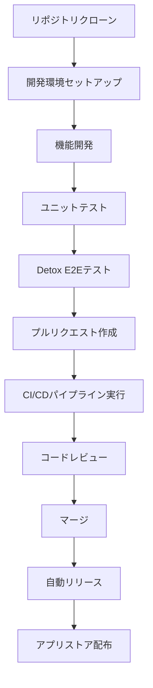

# 📚 FridgeManager 開発フロー完全ガイド

## 📋 概要

FridgeManagerの開発フロー完全ガイドです。リポジトリクローンからリリースまで、Detox自動テストとリリース・バージョンアップ自動化を重視した開発プロセスを網羅しています。

## 🗂️ ドキュメント構成

- [DEVELOPMENT_FLOW.md](./DEVELOPMENT_FLOW.md) - 基本的な開発フロー
- [DETOX_CI_SETUP.md](./DETOX_CI_SETUP.md) - Detox自動テストとCI/CD設定
- [RELEASE_AUTOMATION.md](./RELEASE_AUTOMATION.md) - リリース・バージョンアップ自動化
- このドキュメント - 全体統合ガイド

## 🚀 クイックスタート

### 1. リポジトリクローン

```bash
# リポジトリをクローン
git clone https://github.com/Terrastrix/FridgeManager.git
cd FridgeManager

# 開発ブランチ作成
git checkout -b feature/your-feature-name
```

### 2. 開発環境セットアップ

```bash
# 依存関係インストール
npm install

# 環境変数設定
cp .env.example .env.development
# .env.developmentにFirebase設定を入力

# 環境確認
npm run check:env

# 開発サーバー起動
npm run start:dev
```

### 3. テスト実行

```bash
# ユニットテスト
npm run test:unit

# Detox E2Eテスト（Android）
npm run test:detox:build
npm run test:detox:test

# 全テスト実行
npm run test:all
```

## 🔄 開発フロー詳細

### 日常の開発フロー



### 1. 機能開発

```bash
# 最新コード取得
git pull origin main

# 機能ブランチ作成
git checkout -b feature/new-feature

# 開発・テスト
npm run start:dev
npm run test:unit

# コミット（Conventional Commits形式）
git add .
git commit -m "feat(auth): メール認証機能を追加"

# プッシュ
git push origin feature/new-feature
```

### 2. プルリクエスト作成

```bash
# GitHub上でプルリクエスト作成
# または
gh pr create --title "feat: 新機能追加" --body "詳細な説明"
```

### 3. コードレビュー・マージ

- 自動テストが通ることを確認
- コードレビューを実施
- 承認後、マージ

### 4. 自動リリース

```bash
# マージ後、自動的に以下が実行される：
# 1. バージョン判定（Conventional Commitsベース）
# 2. リリースノート生成
# 3. GitHub Release作成
# 4. アプリストア配布
```

## 🧪 テスト戦略

### テストピラミッド

```
        E2E Tests (Detox)
       /                \
   Integration Tests    UI Tests
  /                    \
Unit Tests (Jest)    Component Tests
```

### テスト実行順序

1. **ユニットテスト** - 個別関数・コンポーネントのテスト
2. **統合テスト** - 複数コンポーネント間の連携テスト
3. **E2Eテスト** - ユーザーシナリオ全体のテスト

### Detoxテストシナリオ

- ユーザー登録・ログイン
- 冷蔵庫管理（在庫更新、食品追加）
- 通知機能
- 招待システム

## 🔧 CI/CDパイプライン

### 自動実行トリガー

- **プッシュ時**: `main`, `develop`ブランチ
- **プルリクエスト時**: `main`ブランチへのPR
- **リリース時**: タグプッシュ

### パイプラインステップ

1. **コード品質チェック**
   - ESLint
   - TypeScript型チェック
   - コードフォーマット

2. **テスト実行**
   - ユニットテスト
   - Detox E2Eテスト（Android/iOS）

3. **ビルド**
   - Android APK/AAB
   - iOS App

4. **リリース**（mainブランチのみ）
   - バージョン判定
   - リリースノート生成
   - GitHub Release作成

## 📱 リリース・バージョンアップ

### セマンティックバージョニング

```
MAJOR.MINOR.PATCH
例: 1.2.3
- MAJOR: 破壊的変更
- MINOR: 新機能追加
- PATCH: バグ修正
```

### 自動バージョン判定

| コミットタイプ | バージョン影響 |
|----------------|----------------|
| `feat` | MINOR |
| `fix` | PATCH |
| `perf` | PATCH |
| `revert` | PATCH |
| `feat!` | MAJOR |
| `docs`, `style`, `refactor`, `test`, `chore`, `ci`, `build` | なし |

### リリースフロー

```bash
# 1. 機能開発完了
git commit -m "feat: 新機能追加"

# 2. プルリクエスト作成・マージ
git push origin feature/new-feature
# GitHub上でPR作成・マージ

# 3. 自動リリース実行
# - バージョン判定
# - リリースノート生成
# - GitHub Release作成
# - アプリストア配布
```

## 🛠️ 開発ツール・スクリプト

### 主要スクリプト

```bash
# 開発・本番環境
npm run start:dev      # 開発環境起動
npm run start:prod     # 本番環境起動
npm run android        # Android実機/エミュレーター起動
npm run ios           # iOS実機/シミュレーター起動

# Firebase操作
npm run firebase:use:dev           # 開発プロジェクトに切り替え
npm run firebase:use:prod          # 本番プロジェクトに切り替え
npm run firebase:deploy:rules:dev  # 開発環境にルールデプロイ
npm run firebase:deploy:rules:prod # 本番環境にルールデプロイ

# ビルド・配布
npm run build:android:dev    # Android開発版ビルド
npm run build:android:prod   # Android本番版ビルド
npm run build:ios:dev        # iOS開発版ビルド
npm run build:ios:prod       # iOS本番版ビルド

# テスト
npm run test:unit            # ユニットテスト
npm run test:e2e             # Web E2Eテスト
npm run test:detox:build     # Detox Androidビルド
npm run test:detox:test      # Detox Androidテスト
npm run test:detox:ios:build # Detox iOSビルド
npm run test:detox:ios:test  # Detox iOSテスト
npm run test:all             # 全テスト実行
npm run test:coverage        # カバレッジレポート生成

# ユーティリティ
npm run check:env            # 環境設定チェック
npm run lint                 # ESLint実行
npm run type-check           # TypeScript型チェック
npm run format               # コードフォーマット
```

## 🔥 Firebase設定

### 環境分離

- `reizouko-dev` - 開発環境
- `reizouko-prod` - 本番環境

### 使用サービス

- **Firestore** - データベース（リアルタイム同期）
- **Authentication** - ユーザー認証（メール認証）
- **Cloud Messaging** - プッシュ通知
- **Analytics** - 使用状況分析
- **Crashlytics** - クラッシュレポート

### Firebase操作

```bash
# Firebase CLIインストール
npm install -g firebase-tools

# Firebaseログイン
firebase login

# 開発プロジェクトに切り替え
npm run firebase:use:dev

# Firestoreルールデプロイ
npm run firebase:deploy:rules:dev

# エミュレーター起動
npm run firebase:emulators
```

## 📊 品質管理

### コード品質目標

- **テストカバレッジ**: 80%以上
- **ESLintエラー**: 0件
- **TypeScriptエラー**: 0件
- **Detoxテスト**: 主要機能100%カバー

### パフォーマンス監視

```bash
# バンドルサイズ分析
npm run analyze

# パフォーマンステスト
npm run test:performance
```

## 🚨 トラブルシューティング

### よくある問題

1. **Detoxテスト失敗**
   ```bash
   # Androidエミュレーター確認
   adb devices
   
   # iOSシミュレーター確認
   xcrun simctl list devices
   ```

2. **Firebase接続エラー**
   ```bash
   # 環境変数確認
   npm run check:env
   
   # Firebase再ログイン
   firebase logout
   firebase login
   ```

3. **ビルドエラー**
   ```bash
   # キャッシュクリア
   npm run clean
   
   # 依存関係再インストール
   rm -rf node_modules
   npm install
   ```

### デバッグツール

```bash
# React Nativeデバッガー
npm run start:dev -- --dev-client

# Firebaseエミュレーター
npm run firebase:emulators

# ログ確認
npm run logs
```

## 📚 参考資料

### 公式ドキュメント

- [Expo公式ドキュメント](https://docs.expo.dev/)
- [Detox公式ドキュメント](https://github.com/wix/Detox)
- [Firebase公式ドキュメント](https://firebase.google.com/docs)
- [React Native公式ドキュメント](https://reactnative.dev/)

### プロジェクトドキュメント

- [README.md](./README.md) - プロジェクト概要
- [QUICKSTART.md](./QUICKSTART.md) - クイックスタートガイド
- [SPECIFICATION.md](./SPECIFICATION.md) - 詳細仕様書
- [FIREBASE_SETUP.md](./FIREBASE_SETUP.md) - Firebase設定手順
- [DevSetUp.md](./DevSetUp.md) - 開発環境セットアップ
- [MANUAL_TEST_CHECKLIST.md](./MANUAL_TEST_CHECKLIST.md) - 手動テストチェックリスト

## 🔄 開発フローまとめ

### 新機能開発の場合

1. **準備**
   ```bash
   git pull origin main
   git checkout -b feature/new-feature
   ```

2. **開発**
   ```bash
   npm run start:dev
   # 開発作業
   npm run test:unit
   ```

3. **テスト**
   ```bash
   npm run test:detox:build
   npm run test:detox:test
   ```

4. **コミット・プッシュ**
   ```bash
   git add .
   git commit -m "feat: 新機能の実装"
   git push origin feature/new-feature
   ```

5. **プルリクエスト**
   - GitHub上でPR作成
   - コードレビュー
   - マージ

6. **自動リリース**
   - バージョン判定
   - リリースノート生成
   - アプリストア配布

### 緊急修正の場合

1. **ホットフィックス**
   ```bash
   git checkout -b hotfix/critical-bug
   ```

2. **修正・テスト**
   ```bash
   # 修正作業
   npm run test:all
   ```

3. **緊急リリース**
   ```bash
   git commit -m "fix: 緊急バグ修正"
   git push origin hotfix/critical-bug
   # PR作成・マージ
   # 自動リリース実行
   ```

## 📈 継続的改善

### メトリクス監視

- リリース頻度
- テストカバレッジ
- ビルド時間
- デプロイ成功率

### 定期的な見直し

- 月次で開発フロー見直し
- 四半期でツール・プロセス改善
- 年次で技術スタック更新

---

**最終更新**: 2025年1月27日  
**バージョン**: 1.0.0  
**ステータス**: 開発中  
**開発者**: Terrastrix
