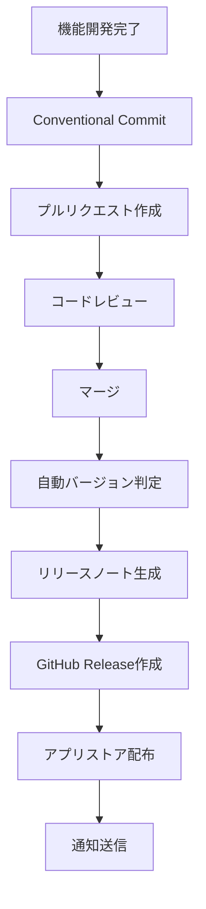

# 🚀 リリース・バージョンアップ自動化ワークフロー

## 📋 概要

FridgeManagerのリリース・バージョンアップを自動化するためのワークフローです。セマンティックバージョニングとConventional Commitsを使用して、効率的なリリース管理を実現します。

## 🔄 リリースフロー全体図



## 📝 1. Conventional Commits設定

### 1.1 コミットメッセージ形式

```
<type>[optional scope]: <description>

[optional body]

[optional footer(s)]
```

### 1.2 タイプ一覧

| タイプ     | 説明               | バージョン影響 |
| ---------- | ------------------ | -------------- |
| `feat`     | 新機能追加         | MINOR          |
| `fix`      | バグ修正           | PATCH          |
| `docs`     | ドキュメント更新   | -              |
| `style`    | コードフォーマット | -              |
| `refactor` | リファクタリング   | -              |
| `test`     | テスト追加・修正   | -              |
| `chore`    | ビルド・設定変更   | -              |
| `perf`     | パフォーマンス改善 | PATCH          |
| `ci`       | CI/CD設定変更      | -              |
| `build`    | ビルドシステム変更 | -              |
| `revert`   | コミット取り消し   | -              |

### 1.3 コミット例

```bash
# 新機能追加（MINORバージョンアップ）
git commit -m "feat(auth): メール認証機能を追加"

# バグ修正（PATCHバージョンアップ）
git commit -m "fix(refrigerator): 在庫更新時の同期エラーを修正"

# 破壊的変更（MAJORバージョンアップ）
git commit -m "feat!: APIレスポンス形式を変更

BREAKING CHANGE: 既存のAPIクライアントは更新が必要です"

# ドキュメント更新（バージョン影響なし）
git commit -m "docs: READMEにセットアップ手順を追加"
```

## 🔧 2. 自動バージョンアップ設定

### 2.1 semantic-release設定

```json
{
  "name": "@semantic-release/changelog",
  "version": "6.0.3",
  "description": "semantic-release plugin to create or update a changelog file",
  "main": "lib/index.js",
  "files": ["lib"],
  "scripts": {
    "semantic-release": "semantic-release"
  },
  "devDependencies": {
    "@semantic-release/changelog": "^6.0.3",
    "@semantic-release/commit-analyzer": "^11.1.0",
    "@semantic-release/git": "^10.0.1",
    "@semantic-release/github": "^9.2.6",
    "@semantic-release/npm": "^10.0.4",
    "@semantic-release/release-notes-generator": "^12.1.0",
    "semantic-release": "^21.1.1"
  }
}
```

### 2.2 .releaserc設定

```json
{
  "branches": [
    "main",
    {
      "name": "develop",
      "prerelease": "beta"
    }
  ],
  "plugins": [
    [
      "@semantic-release/commit-analyzer",
      {
        "preset": "conventionalcommits",
        "releaseRules": [
          {
            "type": "feat",
            "release": "minor"
          },
          {
            "type": "fix",
            "release": "patch"
          },
          {
            "type": "perf",
            "release": "patch"
          },
          {
            "type": "revert",
            "release": "patch"
          },
          {
            "type": "docs",
            "release": false
          },
          {
            "type": "style",
            "release": false
          },
          {
            "type": "refactor",
            "release": false
          },
          {
            "type": "test",
            "release": false
          },
          {
            "type": "chore",
            "release": false
          },
          {
            "type": "ci",
            "release": false
          },
          {
            "type": "build",
            "release": false
          }
        ]
      }
    ],
    [
      "@semantic-release/release-notes-generator",
      {
        "preset": "conventionalcommits",
        "presetConfig": {
          "types": [
            {
              "type": "feat",
              "section": "新機能"
            },
            {
              "type": "fix",
              "section": "バグ修正"
            },
            {
              "type": "perf",
              "section": "パフォーマンス改善"
            },
            {
              "type": "revert",
              "section": "変更取り消し"
            }
          ]
        }
      }
    ],
    [
      "@semantic-release/changelog",
      {
        "changelogFile": "CHANGELOG.md"
      }
    ],
    [
      "@semantic-release/npm",
      {
        "npmPublish": false
      }
    ],
    [
      "@semantic-release/git",
      {
        "assets": ["CHANGELOG.md", "package.json", "package-lock.json"],
        "message": "chore(release): ${nextRelease.version} [skip ci]\n\n${nextRelease.notes}"
      }
    ],
    [
      "@semantic-release/github",
      {
        "assets": [
          {
            "path": "android/app/build/outputs/apk/release/app-release.apk",
            "label": "Android APK"
          },
          {
            "path": "ios/build/Build/Products/Release-iphonesimulator/FridgeManager.app",
            "label": "iOS App"
          }
        ]
      }
    ]
  ]
}
```

## 🚀 3. GitHub Actions リリースワークフロー

### 3.1 .github/workflows/release.yml

```yaml
name: Release

on:
  push:
    branches:
      - main
      - develop

jobs:
  release:
    runs-on: ubuntu-latest
    steps:
      - name: Checkout
        uses: actions/checkout@v3
        with:
          fetch-depth: 0
          token: ${{ secrets.GITHUB_TOKEN }}

      - name: Setup Node.js
        uses: actions/setup-node@v3
        with:
          node-version: '18'
          cache: 'npm'

      - name: Install dependencies
        run: npm ci

      - name: Run tests
        run: npm run test:all

      - name: Build Android
        run: npm run build:android:prod

      - name: Build iOS
        run: npm run build:ios:prod

      - name: Release
        env:
          GITHUB_TOKEN: ${{ secrets.GITHUB_TOKEN }}
        run: npx semantic-release
```

### 3.2 手動リリースワークフロー

```yaml
name: Manual Release

on:
  workflow_dispatch:
    inputs:
      version:
        description: 'Release version (e.g., 1.2.3)'
        required: true
        type: string
      release_type:
        description: 'Release type'
        required: true
        default: 'patch'
        type: choice
        options:
          - patch
          - minor
          - major

jobs:
  manual-release:
    runs-on: ubuntu-latest
    steps:
      - name: Checkout
        uses: actions/checkout@v3
        with:
          fetch-depth: 0
          token: ${{ secrets.GITHUB_TOKEN }}

      - name: Setup Node.js
        uses: actions/setup-node@v3
        with:
          node-version: '18'
          cache: 'npm'

      - name: Install dependencies
        run: npm ci

      - name: Run tests
        run: npm run test:all

      - name: Build apps
        run: |
          npm run build:android:prod
          npm run build:ios:prod

      - name: Create release
        env:
          GITHUB_TOKEN: ${{ secrets.GITHUB_TOKEN }}
        run: |
          npm version ${{ github.event.inputs.release_type }} --no-git-tag-version
          git config --local user.email "action@github.com"
          git config --local user.name "GitHub Action"
          git add package.json package-lock.json
          git commit -m "chore: bump version to ${{ github.event.inputs.version }}"
          git tag "v${{ github.event.inputs.version }}"
          git push origin main --tags
```

## 📱 4. アプリストア配布自動化

### 4.1 EAS Build設定

```json
{
  "cli": {
    "version": ">= 5.9.0"
  },
  "build": {
    "development": {
      "developmentClient": true,
      "distribution": "internal"
    },
    "preview": {
      "distribution": "internal",
      "android": {
        "buildType": "apk"
      }
    },
    "production": {
      "android": {
        "buildType": "aab"
      },
      "ios": {
        "autoIncrement": true
      }
    }
  },
  "submit": {
    "production": {
      "android": {
        "serviceAccountKeyPath": "./google-service-account.json",
        "track": "internal"
      },
      "ios": {
        "appleId": "your-apple-id@example.com",
        "ascAppId": "your-app-store-connect-app-id",
        "appleTeamId": "your-apple-team-id"
      }
    }
  }
}
```

### 4.2 アプリストア配布ワークフロー

```yaml
name: App Store Distribution

on:
  release:
    types: [published]

jobs:
  distribute-android:
    runs-on: ubuntu-latest
    steps:
      - name: Checkout
        uses: actions/checkout@v3

      - name: Setup Node.js
        uses: actions/setup-node@v3
        with:
          node-version: '18'
          cache: 'npm'

      - name: Install dependencies
        run: npm ci

      - name: Install EAS CLI
        run: npm install -g @expo/eas-cli

      - name: Login to EAS
        run: eas login --non-interactive
        env:
          EXPO_TOKEN: ${{ secrets.EXPO_TOKEN }}

      - name: Build Android
        run: eas build --platform android --non-interactive

      - name: Submit to Google Play
        run: eas submit --platform android --non-interactive
        env:
          GOOGLE_SERVICE_ACCOUNT_KEY: ${{ secrets.GOOGLE_SERVICE_ACCOUNT_KEY }}

  distribute-ios:
    runs-on: macos-latest
    steps:
      - name: Checkout
        uses: actions/checkout@v3

      - name: Setup Node.js
        uses: actions/setup-node@v3
        with:
          node-version: '18'
          cache: 'npm'

      - name: Install dependencies
        run: npm ci

      - name: Install EAS CLI
        run: npm install -g @expo/eas-cli

      - name: Login to EAS
        run: eas login --non-interactive
        env:
          EXPO_TOKEN: ${{ secrets.EXPO_TOKEN }}

      - name: Build iOS
        run: eas build --platform ios --non-interactive

      - name: Submit to App Store
        run: eas submit --platform ios --non-interactive
        env:
          APPLE_ID: ${{ secrets.APPLE_ID }}
          APPLE_ID_PASSWORD: ${{ secrets.APPLE_ID_PASSWORD }}
          ASC_APP_ID: ${{ secrets.ASC_APP_ID }}
          APPLE_TEAM_ID: ${{ secrets.APPLE_TEAM_ID }}
```

## 📊 5. リリース監視・通知

### 5.1 リリース通知設定

```yaml
name: Release Notification

on:
  release:
    types: [published]

jobs:
  notify:
    runs-on: ubuntu-latest
    steps:
      - name: Notify Slack
        uses: 8398a7/action-slack@v3
        with:
          status: ${{ job.status }}
          channel: '#releases'
          text: |
            🚀 新しいリリースが公開されました！

            **バージョン**: ${{ github.event.release.tag_name }}
            **リリースノート**: ${{ github.event.release.body }}
            **ダウンロード**: ${{ github.event.release.html_url }}
        env:
          SLACK_WEBHOOK_URL: ${{ secrets.SLACK_WEBHOOK_URL }}

      - name: Notify Discord
        uses: Ilshidur/action-discord@master
        with:
          args: |
            🚀 **FridgeManager リリース**

            **バージョン**: ${{ github.event.release.tag_name }}
            **リリースノート**: ${{ github.event.release.body }}
            **ダウンロード**: ${{ github.event.release.html_url }}
        env:
          DISCORD_WEBHOOK: ${{ secrets.DISCORD_WEBHOOK }}
```

### 5.2 リリース監視ダッシュボード

```javascript
// scripts/release-monitor.js
const { execSync } = require('child_process');
const fs = require('fs');

class ReleaseMonitor {
  constructor() {
    this.releaseData = this.loadReleaseData();
  }

  loadReleaseData() {
    try {
      return JSON.parse(fs.readFileSync('release-data.json', 'utf8'));
    } catch (error) {
      return {
        lastRelease: null,
        releaseHistory: [],
        metrics: {
          totalReleases: 0,
          averageReleaseInterval: 0,
          lastReleaseDate: null,
        },
      };
    }
  }

  async checkForNewReleases() {
    try {
      const latestRelease = execSync(
        'gh release list --limit 1 --json tagName,publishedAt',
        { encoding: 'utf8' }
      );
      const release = JSON.parse(latestRelease)[0];

      if (release.tagName !== this.releaseData.lastRelease) {
        this.updateReleaseData(release);
        this.generateReleaseReport();
      }
    } catch (error) {
      console.error('リリース確認エラー:', error.message);
    }
  }

  updateReleaseData(release) {
    this.releaseData.lastRelease = release.tagName;
    this.releaseData.releaseHistory.push({
      version: release.tagName,
      date: release.publishedAt,
      timestamp: new Date().toISOString(),
    });

    this.releaseData.metrics.totalReleases++;
    this.releaseData.metrics.lastReleaseDate = release.publishedAt;

    this.saveReleaseData();
  }

  generateReleaseReport() {
    const report = {
      timestamp: new Date().toISOString(),
      totalReleases: this.releaseData.metrics.totalReleases,
      lastRelease: this.releaseData.lastRelease,
      releaseHistory: this.releaseData.releaseHistory.slice(-10), // 最新10件
    };

    fs.writeFileSync('release-report.json', JSON.stringify(report, null, 2));
    console.log('リリースレポートを生成しました:', report);
  }

  saveReleaseData() {
    fs.writeFileSync(
      'release-data.json',
      JSON.stringify(this.releaseData, null, 2)
    );
  }
}

// 実行
const monitor = new ReleaseMonitor();
monitor.checkForNewReleases();
```

## 🔧 6. 開発者向けリリースツール

### 6.1 リリース準備スクリプト

```bash
#!/bin/bash
# scripts/prepare-release.sh

set -e

echo "🚀 リリース準備を開始します..."

# 1. 最新コードを取得
echo "📥 最新コードを取得中..."
git fetch origin
git checkout main
git pull origin main

# 2. 依存関係を更新
echo "📦 依存関係を更新中..."
npm ci

# 3. テストを実行
echo "🧪 テストを実行中..."
npm run test:all

# 4. ビルドを実行
echo "🔨 ビルドを実行中..."
npm run build:android:prod
npm run build:ios:prod

# 5. リリース候補を確認
echo "📋 リリース候補を確認中..."
npm run release:candidate

echo "✅ リリース準備が完了しました！"
echo "次のステップ: git push origin main"
```

### 6.2 リリース候補確認スクリプト

```javascript
// scripts/release-candidate.js
const { execSync } = require('child_process');
const fs = require('fs');

function checkReleaseCandidate() {
  console.log('🔍 リリース候補を確認中...');

  // 1. コミット履歴を確認
  const commits = execSync('git log --oneline --since="1 week ago"', {
    encoding: 'utf8',
  });
  console.log('📝 最近のコミット:');
  console.log(commits);

  // 2. 変更されたファイルを確認
  const changedFiles = execSync('git diff --name-only HEAD~5..HEAD', {
    encoding: 'utf8',
  });
  console.log('📁 変更されたファイル:');
  console.log(changedFiles);

  // 3. パッケージバージョンを確認
  const packageJson = JSON.parse(fs.readFileSync('package.json', 'utf8'));
  console.log('📦 現在のバージョン:', packageJson.version);

  // 4. リリースノートを生成
  const releaseNotes = execSync(
    'npx conventional-changelog -p angular -i CHANGELOG.md -s',
    { encoding: 'utf8' }
  );
  console.log('📋 リリースノート:');
  console.log(releaseNotes);

  console.log('✅ リリース候補の確認が完了しました！');
}

checkReleaseCandidate();
```

## 📈 7. リリースメトリクス

### 7.1 リリース統計

```javascript
// scripts/release-metrics.js
const { execSync } = require('child_process');
const fs = require('fs');

class ReleaseMetrics {
  constructor() {
    this.metrics = this.loadMetrics();
  }

  loadMetrics() {
    try {
      return JSON.parse(fs.readFileSync('release-metrics.json', 'utf8'));
    } catch (error) {
      return {
        totalReleases: 0,
        releaseFrequency: [],
        featureReleases: 0,
        bugFixReleases: 0,
        patchReleases: 0,
        averageReleaseInterval: 0,
      };
    }
  }

  calculateMetrics() {
    const releases = execSync('gh release list --json tagName,publishedAt', {
      encoding: 'utf8',
    });
    const releaseList = JSON.parse(releases);

    this.metrics.totalReleases = releaseList.length;

    // リリース頻度を計算
    const intervals = [];
    for (let i = 1; i < releaseList.length; i++) {
      const prevDate = new Date(releaseList[i - 1].publishedAt);
      const currDate = new Date(releaseList[i].publishedAt);
      const interval = (currDate - prevDate) / (1000 * 60 * 60 * 24); // 日数
      intervals.push(interval);
    }

    this.metrics.averageReleaseInterval =
      intervals.reduce((a, b) => a + b, 0) / intervals.length;

    // リリースタイプを分析
    releaseList.forEach((release) => {
      const version = release.tagName.replace('v', '');
      const [major, minor, patch] = version.split('.').map(Number);

      if (patch === 0 && minor === 0) {
        this.metrics.featureReleases++;
      } else if (patch > 0) {
        this.metrics.patchReleases++;
      }
    });

    this.saveMetrics();
    this.generateReport();
  }

  generateReport() {
    const report = {
      timestamp: new Date().toISOString(),
      metrics: this.metrics,
      summary: {
        totalReleases: this.metrics.totalReleases,
        averageReleaseInterval: Math.round(this.metrics.averageReleaseInterval),
        featureReleases: this.metrics.featureReleases,
        patchReleases: this.metrics.patchReleases,
      },
    };

    fs.writeFileSync(
      'release-metrics-report.json',
      JSON.stringify(report, null, 2)
    );
    console.log('📊 リリースメトリクスレポート:');
    console.log(JSON.stringify(report.summary, null, 2));
  }

  saveMetrics() {
    fs.writeFileSync(
      'release-metrics.json',
      JSON.stringify(this.metrics, null, 2)
    );
  }
}

// 実行
const metrics = new ReleaseMetrics();
metrics.calculateMetrics();
```

---

**最終更新**: 2025年1月27日  
**バージョン**: 1.0.0  
**ステータス**: 開発中
